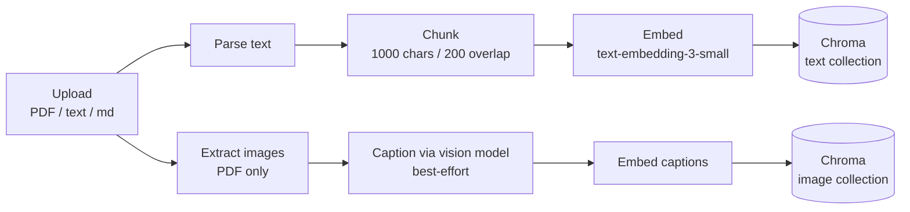
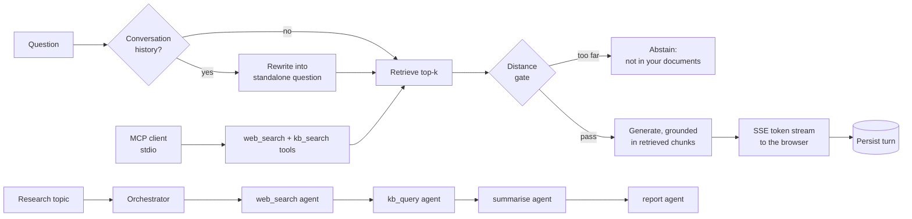

# Nexus AI

A RAG research assistant: ask a natural-language question, get an answer grounded in your own document corpus — with citations, streaming delivery, and a gate that says "not found in your documents" instead of guessing. Every capability claim below is backed by a committed evaluation artifact in `backend/evals/results/`.

[](https://github.com/FlorianTraugott/nexus/actions/workflows/ci.yml)

Status: backend + frontend feature-complete (auth, ingestion, RAG with abstention, streaming chat with conversation memory, multi-agent research, MCP server, evaluation harness); CI covers both. Not yet deployed anywhere.

## Architecture

Two pipelines share one vector store and one auth boundary. Every retrieval path derives the user from auth — there is no unscoped search.

**Ingestion** (background task per uploaded document):



**Query, research, and MCP** (all user-scoped):



The research orchestrator is hand-rolled (no LangGraph): four agents pass a typed `ResearchState`, web search degrades gracefully (empty results + a warning), while KB/summarise/report failures are recorded as the run's error. `POST /research` returns `202` + a task id; the frontend polls with a self-stopping interval and a stall ceiling.

| Layer | Actual stack |
|---|---|
| Backend | FastAPI (async), SQLAlchemy 2.0 (async), PostgreSQL, Alembic, ChromaDB |
| Models | `gpt-4.1-mini` (generation + vision captioning), `text-embedding-3-small`; faithfulness judge: Gemini via its OpenAI-compatible endpoint |
| Protocols | REST + SSE (streaming answers), MCP over stdio (`web_search`, `kb_search`) |
| Frontend | Next.js 16 / React 19, TypeScript strict, Tailwind v4, shadcn/ui (base-ui), TanStack Query, Zustand; hand-rolled SSE client (EventSource can't send auth headers or a POST body) |
| Infra | Docker Compose (dev), GitHub Actions (backend lint/test/docker-build + frontend tsc/build) |

## Measured results

All numbers below come from committed artifacts in [`backend/evals/results/`](backend/evals/results/) and are reproducible with the eval harness commands in [Setup](#setup) — numbers a reader can regenerate are claims; numbers they can't are assertions.

**Golden set:** 22 hand-labelled questions over 5 public-domain NIST documents + 1 synthetic image fixture — 19 answerable (7 marked HARD), 3 out-of-corpus negatives. Labels are content substrings (`expect_contains`), not chunk indexes, so the set survives re-chunking. Ground truth is hand-authored, never LLM-generated.

| Instrument | Result | Artifact |
|---|---|---|
| Retrieval (k=5) | hit@5 **0.842** · MRR **0.719** · doc-top1 **0.684** | `baseline.json` |
| — HARD subset (n=7) | hit@5 0.857 · doc-top1 **0.286** (the doc mis-ranking finding, F3) | `baseline.json` |
| Abstention gate | **3/3** out-of-corpus questions correctly abstained · **0** false abstentions | `baseline.json` |
| Faithfulness (LLM judge) | **17/18** answers fully faithful · mean severity **0.978** · 1 no-claims | `faithfulness_baseline.json` |
| Conversational (first-light, 3 conversations / 6 turns) | follow-up rewrite changed **3/3** and resolved the referent **3/3** · retrieval hit 1.0 for both openers and follow-ups · faithfulness 4/5 with 1 gate abstention | `conversational_baseline.json` |

The faithfulness verdict is "zero unsupported claims", not a score threshold (claim-decomposition granularity varies by judge model). The judge (`gemini-3.1-flash-lite`) is a different model family from the generator (`gpt-4.1-mini`) because self-preference bias runs along family lines, and it was validated against a hand-labelled calibration set — including a deliberately unfaithful answer whose claims are true in the world but absent from the retrieved context — before its numbers were trusted (5/5 agreement).

**Chunking parameter sweep** (`results/chunking/`): three size/overlap variants (1000/400, 1600/320, 600/150) against pre-agreed adoption criteria produced a **null result** — the two structural retrieval misses never flipped anywhere on the parameter frontier, in either direction. The sweep still paid: chunk size strongly drives document-level ranking (doc-top1 0.684 → **0.947**, HARD 0.286 → **0.857** at 1600/320), and the abstention threshold is calibrated to a chunk size (the same variant pushed one legitimate answer's distance to 0.5098, past the 0.500 gate). At 19 answerable questions, one flip moves hit@5 by ~5 points — these are counts, not smooth rates, and the per-question miss lists in the artifacts are the real record.

**What these instruments do NOT measure.** Faithfulness scores grounding in the *retrieved context*, not truth in the world — an answer faithful to a wrong or outdated passage still scores well. The judge is a single model family, so the magnitude of judge bias is unbounded here (a second-family cross-check over the same calibration set is a recorded deferral). The conversational eval is first-light at n=6 turns, not a locked baseline.

## Deliberate decisions

- **Hand-rolled over frameworks** — no LangChain/LangGraph, and eval metrics (hit@k, MRR, faithfulness) implemented directly rather than via RAGAS: direct control, and the mechanics stay visible instead of hiding behind the abstraction the project exists to demonstrate.
- **Images live in their own vector collection** — mixing caption embeddings into the text collection would force heterogeneous retrieval results through every text surface (citations, MCP, research agents), re-opening verified code to buy text+image fusion, which is deferred anyway.
- **Abstention is a query-layer policy, not a retrieval change** — `retrieve()` returns raw ranked results; callers apply a shared distance gate. MCP search and the research agents see unfiltered retrieval; only the answer-generating endpoints abstain.
- **The judge is a different model family from the generator** — a model grading its own family's output over-credits answers phrased the way it would have phrased them.
- **Golden labels are content substrings, not chunk indexes** — re-ingestion mints new chunk ids; index-based labels would have made every chunking experiment unscoreable. This decision is what made the parameter sweep possible at all.
- **Streaming is an additive sibling, never a rewrite** — `/query/stream` reproduces `/query`'s pipeline and diverges only at the generate call, so the sync path the eval baselines measure stays byte-for-byte identical.
- **Token refresh is single-flight by construction** — refresh tokens rotate and are single-use, so parallel refreshes revoke each other; every consumer (axios interceptor, fetch-based SSE client) joins one shared promise rather than being asked to behave.

## Honest limitations

Measured, not guessed — each of the first three came out of the eval harness and is reproducible from the artifacts:

- **Chunk boundaries split rationale from subject** (F1): a once-stated rationale never surfaces; the generator fills the gap from world knowledge — the sole unfaithful answer in the baseline. The distance gate cannot catch it (the retrieved context is relevant, just incomplete). Parameter changes don't fix it (measured); a structure-aware chunker is the earned next step.
- **Dense enumerated lists flatten** (F2): a specific line among ~30 near-identical ones is not retrieved. Same structural cause, same measured null on parameters.
- **Confusable documents mis-rank** (F3): on HARD questions the right content is retrieved from the wrong document first (doc-top1 0.286 vs 0.917 on normal). Candidate fix is a reranker; the sweep showed chunk geometry also moves this number substantially.

And by decision rather than measurement:

- Voice (Whisper STT / TTS) — deferred, not abandoned.
- `source_type` enum lists `youtube` and `web`, but only PDF/text/markdown ingestion is implemented.
- Text+image fusion — text and image search are separate surfaces; one query does not rank both together.
- Web search defaults to a null provider (empty results); a live Tavily run has not been exercised.
- No live deployment yet (Part 12); the frontend keeps tokens in `localStorage` with the XSS tradeoff acknowledged — the production answer is httpOnly cookies, which needs a backend change.

## Setup

Prerequisites: Docker + Docker Compose, Python 3.12 (for the venv-based workflows), Node 24 (frontend; CI pins 24).

```bash
git clone git@github.com:FlorianTraugott/nexus.git && cd nexus
cp .env.example .env
# Fill in: POSTGRES_USER / POSTGRES_PASSWORD / POSTGRES_DB, OPENAI_API_KEY,
# and JWT_SECRET_KEY (generate: openssl rand -hex 32).
# TAVILY_API_KEY is optional (web search degrades to empty results without it).
# ELEVENLABS/SENTRY/LANGFUSE vars exist in the template but are currently unused.

make up          # postgres + backend  ->  http://localhost:8000/docs
make upgrade     # apply migrations (in a second terminal, once the stack is up)
```

Frontend (not in docker-compose; runs directly):

```bash
cd frontend
npm install
npm run dev      # http://localhost:3000 — must be :3000, CORS allows only that origin
# NEXT_PUBLIC_API_URL is optional and defaults to http://localhost:8000
```

Useful targets: `make help` lists them all (`up`, `down`, `logs`, `dev`, `lint`, `format`, `test`, `migrate`, `upgrade`, `downgrade`, `hooks`, `clean`).

### Reproducing the eval numbers

From `backend/` with the venv active, `OPENAI_API_KEY` set, and the database up:

```bash
./evals/download_corpus.sh                 # fetch the public NIST corpus (idempotent)
python -m evals.setup_eval_corpus          # ingest it under a dedicated eval user (idempotent)

python -m evals.run_retrieval_eval --k 5 --json evals/results/baseline.json
python -m evals.run_faithfulness_calibration   # validate the judge BEFORE trusting its numbers
python -m evals.run_faithfulness_eval --k 5 --json evals/results/faithfulness_baseline.json
python -m evals.run_conversational_eval --k 5 --json evals/results/conversational_baseline.json

# Chunking experiments: re-chunk the eval corpus under different parameters
# (text-only; images/captions preserved; refuses to touch any non-eval account)
CHUNK_SIZE=1600 CHUNK_OVERLAP=320 python -m evals.setup_eval_corpus --reingest
CHUNK_SIZE=1600 CHUNK_OVERLAP=320 python -m evals.run_retrieval_eval --k 5 --json evals/results/chunking/my-variant.json
```

The faithfulness runs need a judge key (Gemini, via its OpenAI-compatible endpoint) configured in `.env`.

## MCP server

The backend doubles as an [MCP](https://modelcontextprotocol.io) server, exposing `web_search` and `kb_search` (owner-scoped retrieval over your own corpus) to any MCP client over stdio.

```bash
cd backend
python -m app.mcp.server      # silent wait = success
```

Register it with a client via an `.mcp.json` (git-ignored, machine-specific):

```json
{
  "mcpServers": {
    "nexus": {
      "command": "/path/to/nexus/venv/bin/python",
      "args": ["-m", "app.mcp.server"],
      "cwd": "/path/to/nexus/backend",
      "env": { "NEXUS_MCP_USER_ID": "<your-user-uuid>" }
    }
  }
}
```

Secrets stay in `backend/.env` (the server loads them from `cwd`). `NEXUS_MCP_USER_ID` is required for `kb_search` and scopes retrieval to one user — an unset or invalid value fails loudly rather than searching across users.

## Project structure

```
nexus/
├── backend/
│   ├── app/
│   │   ├── api/         # route handlers (auth, documents, query, conversations, research, vision)
│   │   ├── agents/      # research agents + hand-rolled orchestrator
│   │   ├── core/        # config, logging, security
│   │   ├── db/          # models, repositories, sessions
│   │   ├── mcp/         # MCP server (stdio)
│   │   └── services/    # ingestion, retrieval, generation, faithfulness, ...
│   ├── evals/           # golden sets, runners, committed result artifacts
│   └── tests/
├── frontend/
│   ├── app/             # routes: login/register, dashboard, documents, chat, research
│   ├── components/      # chat view, providers, route guard, ui primitives
│   ├── hooks/           # stream-driving chat hook, React Query hooks
│   └── lib/             # api client (single-flight refresh), SSE client, domain policy
├── docker-compose.yml   # dev stack: postgres + backend
└── Makefile
```

## Workflow

GitFlow (`feature/*` off `develop`), Conventional Commits, four-job CI (backend lint → test → docker build, frontend tsc + build in parallel). A failing job blocks the merge.

## License

MIT
